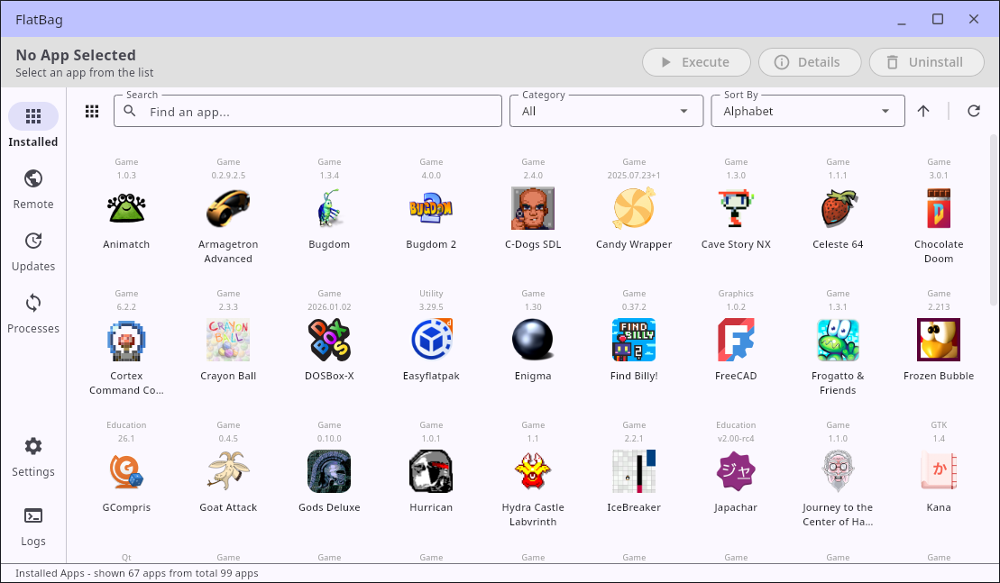
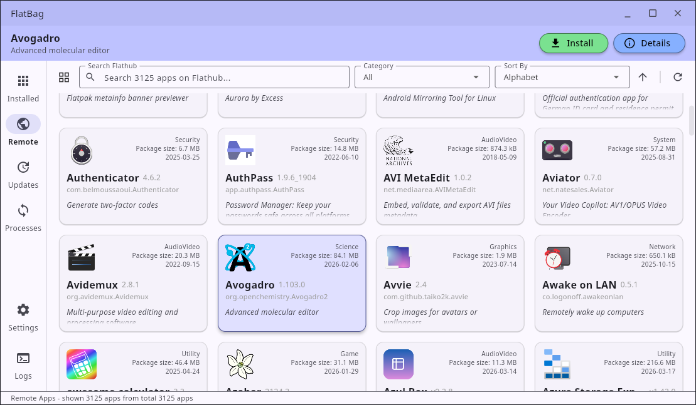
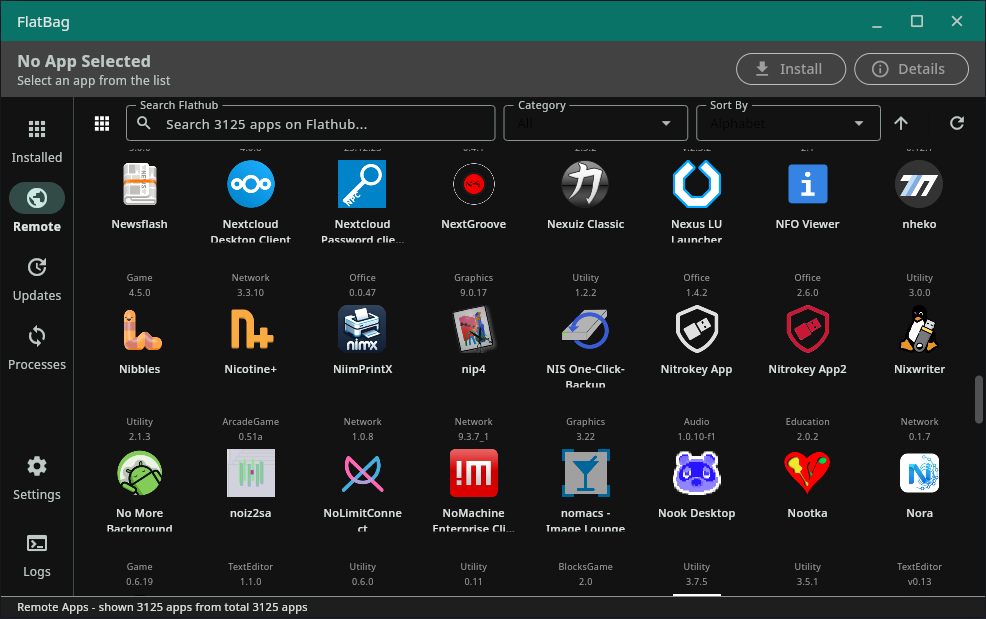

# FlatBag

A fast, elegant graphical interface for managing Flatpak applications on Linux, built with Flutter.

Currently, the project is built to work with x86_64 applications only.

Flatpak is not part of this project.

FlatBag makes use of the Flathub online API in order to fetch updated data.


## Features

* **Browse & Search:** Easily find installed applications and search for new ones from Flathub.
* **Install & Uninstall:** Manage your Flatpak applications (both user and system-wide) with a simple click.
* **Updates:** Check for and apply Flatpak updates.
* **App Details:** View rich information, screenshots, and release notes powered by Flathub data.
* **Background Tasks:** Queue multiple operations (installations, updates, uninstalls) and track their progress via the built-in process manager.

## Screenshots





## Requirements

To build and run FlatBag, you will need:
* [Flutter SDK](https://docs.flutter.dev/get-started/install/linux) (version 3.11.0 or later)
* `flatpak` installed on your Linux system
* A Linux desktop environment (GNOME, KDE, etc.)

## Compilation Instructions

1. Clone the repository and navigate into the project directory:
   ```bash
   git clone <your-repository-url>
   cd flatbag
   ```

2. Fetch the Flutter dependencies:
   ```bash
   flutter pub get
   ```

3. Build the release executable for Linux:
   ```bash
   flutter build linux --release
   ```
   *Once compiled, the executable and required bundle files will be located at `build/linux/x64/release/bundle/`.*

## Workflow Resources

During execution, FlatBag interacts with the following resources:

**Configuration Files:**
* Linux: `~/.config/flatbag/settings.json` (or `$XDG_CONFIG_HOME/flatbag/settings.json`)

**Cache Files:**
* Linux: `~/.cache/flatbag/` (or `$XDG_CACHE_HOME/flatbag/`)
  * `flathub_apps_details.json` & `flathub_apps_details.json.meta` (Flathub repository cache)
  * `flathub_eol.json` (End-of-life app registry)
  * `sizes_cache.json` (App download sizes cache)

**External Commands Executed:**
* `flatpak` (for `run`, `install`, `uninstall`, `update`, and `remote-ls`)

## License

This project is licensed under the MIT License - see the LICENSE file for details.
